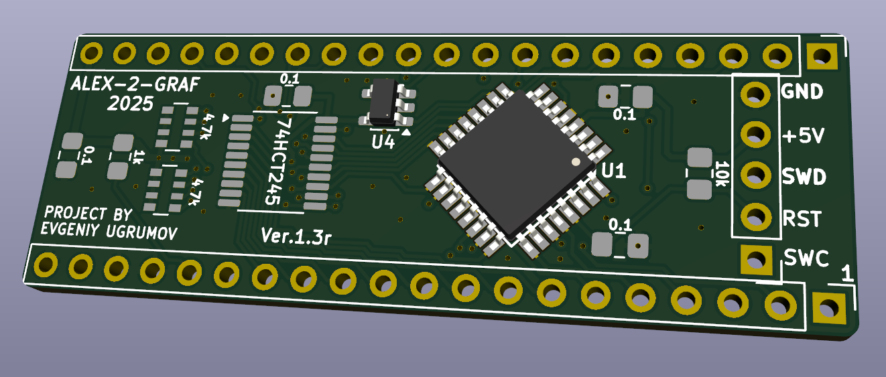
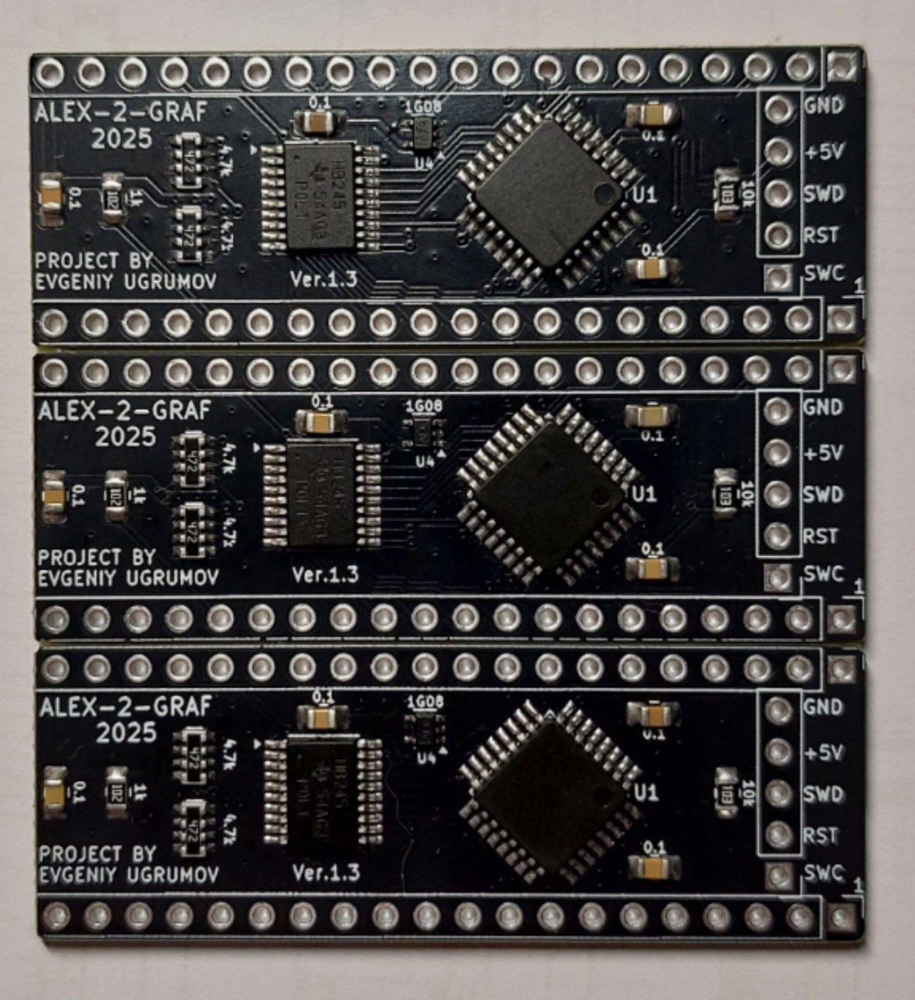

# VG93-MB8877-lgt8f328p-emulator  
  
Hardware layout for Evgeny Ugryumov's WD1793/MB8877/ВГ93 floppy disk controller emulator based on LGT8F328P MCU.  

---

# Эмулятор контроллера дисковода КР1818ВГ93 (MB8877/WD1793) на чипе LGT8F328P MCU

Проект аппаратного эмулятора советской микросхемы КР1818ВГ93 (и её зарубежного аналога FD1793 / MB8877) на базе доступного и быстрого микроконтроллера LGT8F328P. 

Предназначен для замены дефицитных или вышедших из строя чипов FDC в ретро-компьютерах ZX Spectrum и др.

- **Разработка прошивки:** Евгений Угрюмов.
- **Трассировка платы-переходника (PCB Layout):** [Alex-2-Graf](https://github.com/Alex-2-Graf).

Проект является аппаратным развитием оригинальной идеи эмуляции FDC ВГ93 на базе производительного микроконтроллера LGT8F328P. Данная плата-переходник спроектирована для удобной установки эмулятора в стандартную 40-пиновую панель вместо оригинальной микросхемы КР1818ВГ93 / MB8877.

## ⚡ Особенности и преимущества LGT8F328P
- **Тактовая частота 32 МГц:** обеспечивает высокую точность таймингов шины.
- **Быстрый Core:** выполнение большинства инструкций за 1 такт.
- **Логика 5V:** полная совместимость с уровнями сигналов ретро-ЭВМ без делителей.
- **Низкая цена:** контроллер значительно дешевле оригинальных микросхем ВГ93.

## 🛠️ Поддерживаемый функционал
- Эмуляция базовых команд чтения/записи секторов.
- Поддержка сигналов шагового двигателя (STEP, DIR).
- Точная эмуляция сигналов READY, INDEX, TRACK 00.

## 🔌 Аппаратная реализация (Hardware Details)
  
Было выпущено 3 ревизии эмулятора.
  
### Первая ревизия (не рекомендуется для повторения)
  
[Схема](Export/ВГ93-LGT_v1.1.pdf) [Монтаж](Export/ВГ93-LGT_v1.1.html) [Gerber](Gerber/VG93-LGT_1.1_GERBER.zip)
  
  
  
  
  
  
  
### Вторая ревизия (используются диоды)
  
[Схема](Export/ВГ93-LGT_v1.2.pdf) [Монтаж](Export/ВГ93-LGT_v1.2.html) [Gerber](Gerber/VG93-LGT_1.2_GERBER.zip)
  
  
  
  
  
### Третья ревизия (используется 74AHC1G08)
  
[Схема](Export/ВГ93-LGT_v1.3.pdf) [Монтаж](Export/ВГ93-LGT_v1.3.html)
  
Так как 74AHC1G08 можно найти в двух корпусах, то и платы две
  
[Мелкий SC-70](Gerber/VG93-LGT_1.3_SC-70_GERBER.zip) и [Крупный SOT-23-5](Gerber/VG93-LGT_1.3r_SOT-23-5_GERBER.zip)
  
  
  

  
  
  
  
---  
  
## Инструкция по прошивке

Для прошивки нам понадобится прогрямматор.
Его можно изготовить из arduino [LarduinoISP](Programmer/LarduinoISP.zip)
Либо из RP2040 [LarduinoISP](Programmer/RP2040_HRDY_LarduinoISP_Prog.zip)

Далее прошить при помощи [AVRDUDESS](Programmer/AVRDUDESS-2.18-portable.zip)  

Прошивки [тут](Firmware)
Новые прошивки можно найти в канале [ZX-FLOPPY](https://t.me/zx_floppy)

## 👥 Авторство и благодарности (Credits)

Особая благодарность Евгению Угрюмову за проделанную работу [ZX-FLOPPY](https://t.me/zx_floppy).
Александру UR4QBP за массу эксперементов. Его реализация проекта [тут](https://www.youtube.com/live/jW95_YxV7ts?si=LEU0tBd916IoQcGA)
HRDY [Дмитрию](https://github.com/demyanenko-d) за реализацию программатора на базе RP2040
  
## 📄 Лицензия
Проект распространяется под лицензией MIT. Подробности в файле `LICENSE`.

